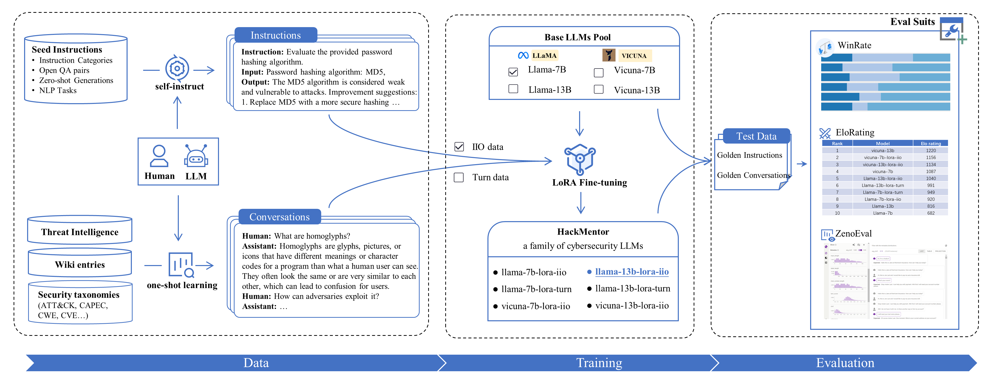

**[中文](README-ZH.md)** | [English](README.md)

# [HackMentor: Fine-Tuning Large Language Models for Cybersecurity](HackMentor.pdf)



HackMentor is a cybersecurity LLMs (Large Language Models) focused on domain-specific data fine-tuning. This project consists of three main parts: data construction, model training, and model evaluation.

Also, you can get more detailed information by reading [paper interpretation: 中科院信工所 | HackMentor-面向网络安全领域的大语言模型微调](https://mp.weixin.qq.com/s/EnGdEm0p6cXrdk42yrB90w)


## Features

- Data construction: Methods and tools for creating domain-specific datasets (instructions & conversations) for fine-tuning LLMs.
- Model training: Techniques and processes for training LLMs on the constructed datasets.
- Model evaluation: Metrics and evaluation methodologies to assess the performance of the fine-tuned models.

## Lora-weights Model

We release the Lora-weights model, which is available for download.

### Download Lora-weights

All HackMentor weights are accessible [here]((https://drive.google.com/drive/folders/1_woz0dsFKq8QYU-X3q0PGoyGoDn-a20t?usp=drive_link)), and the specified Lora-weights can be accessed in the table below:

| HackMentor | Lora-weights |
|-----|-----|
| llama-7b-lora-iio | [download](https://drive.google.com/drive/folders/13xbcQMizfWBtLAJ7OeyRco9QbVn0ZdcM?usp=drive_link) |
| **llama-13b-lora-iio** | [download](https://drive.google.com/drive/folders/17i3A1uuCkpPUJo3DGLvxMVZwqjviqcoE?usp=drive_link) |
| vicuna-7b-lora-iio | [download](https://drive.google.com/drive/folders/1lOEn7QH153QqZ10sFYKdB9afCSkIinMK?usp=drive_link) |
| vicuna-13b-lora-iio | [download](https://drive.google.com/drive/folders/1SF51j4KDyGM356vLx-KuKIni7xYWNbTf?usp=drive_link) |
| llama-7b-lora-turn | [download](https://drive.google.com/drive/folders/1e-Hb3YHlo25y6CL-RhRnrQLTurhgF1Af?usp=drive_link) |
| llama-13b-lora-turn | [download](https://drive.google.com/drive/folders/1lElL6WH1MUWTQZge5utMnmH7aUNIiheK?usp=drive_link) |


*Notes:*
1. The naming convention for HackMentor is as follows: {base model}-{model size}-{fine-tuning method}-{fine-tuning data}. Here, the base model can be Llama/Vicuna, the model size can be 7b/13b, the fine-tuning method can be Lora (with plans to include full-parameters fine-tuning), and the fine-tuning data can be iio or turn, where iio represents Instruction, Input, Output data, and turn represents conversation data.
2. In our testing, the best-performing model was **Llama-13b-Lora-iio**, for reference.


## Local Deployment and Usage

To deploy and utilize the Lora-weights model locally, follow the steps below:

1. Download the base models Llama/Vicuna and the Lora-weights model provided by this project, and place them in the `models` directory.:


2. Download `chat.py`, configure the environment, and ensure the following dependencies are installed for running the Python file:

    ```python
    bitsandbytes==0.39.0
    fire==0.5.0
    peft @ git+https://github.com/huggingface/peft.git@3714aa2fff158fdfa637b2b65952580801d890b2
    torch==2.0.1
    transformers==4.28.1
    ```

3. Switch to the corresponding directory and run the scripts shown in the table below according to the requirements:

    | base-model | lora-weights | domain | execute-command |
    | --- | --- | --- | --- |
    | llama-7b | - | general | `python chat.py --base_model models/pretrained/llama-7b --use_lora False` |
    | vicuna-13b | - | general | `python chat.py --base_model models/pretrained/vicuna-13b --use_lora False` |
    | **llama-13b** | **llama-13b-lora-iio** | **security** | `python chat.py --base_model models/pretrained/llama-13b --lora_model models/lora_models/llama-13b-lora-iio` |
    | vicuna-7b | vicuna-7b-lora-iio | security | `python chat.py --base_model models/pretrained/vicuna-7b  --lora_model models/lora_models/vicuna-7b-lora-iio` |
    | llama-7b | llama-7b-lora-turn | security | `python chat.py --base_model models/pretrained/llama-7b --lora_model models/lora_models/llama-7b-lora-turn` |
    | ...  | ... | ... | ... |


Please note that the above code examples are for illustrative purposes only and you may need to make appropriate adjustments based on your specific situation.


## QA

1. Q1: About computing resources and training time.
   
   A1: Computing resources are dependent on model size and training methods. For LoRA fine-tuning of the 7/13b model, 1\*A100 GPU is sufficient; for full-parameters fine-tuning, the 7b model requires 2/3\*A100 GPUs, while the 13b model requires 4\*A100 GPUs.
   
   Training time is influenced by the amount of data and training methods. With the LoRA method, using 30,000 data samples, an A100 GPU can complete training in approximately 4 hours; for full-parameters fine-tuning, the training time is expected to be around 3-5 or more times longer than the LoRA method.

   (Please note that training time may vary slightly and is provided for reference only.)

2. Q２：Do you train and validate the effectiveness of a specific security task with LLMs, such as security information extraction?
   
   A２：No, the purpose of this work is to enhance/ignite the overall security capabilities of LLM for general security skills.


## Contribution

We welcome contributions to the HackMentor project. If you find any issues or have any improvement suggestions, please submit an issue or send a pull request. Your contributions will help make this project better.


## Acknowledgements
This project refers to the following open source projects, and I would like to express my gratitude to the relevant projects and research and development personnel.
- [Llama by Meta](https://github.com/facebookresearch/llama)
- [FastChat by @im-sys](https://github.com/lm-sys/FastChat)
- [Stanford_alpaca by @tatsu-lab](https://github.com/tatsu-lab/stanford_alpaca)


## Citation
If you use the data or code of this project, or if our work is helpful to you, please state the citation

```
@inproceedings{hackmentor2023,
  title={HackMentor: Fine-tuning Large Language Models for Cybersecurity},
  author={Jie Zhang, Hui Wen*, Liting Deng, Mingfeng Xin, Zhi Li, Lun Li, Hongsong Zhu, and Limin Sun},
  booktitle={2023 IEEE International Conference on Trust, Security and Privacy in Computing and Communications (TrustCom)},
  year={2023},
  organization={IEEE}
}
```
